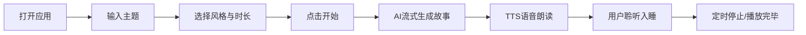

## 1. 产品概述

「长夜故事」是一款AI驱动的助眠应用，用户输入主题后，AI自动生成宏大悠长、细节丰富的故事/报告，配合舒缓的语音朗读，帮助用户在聆听中入眠。支持电脑浏览器和安卓手机跨平台使用。

- 核心痛点：失眠人群需要长时间、低刺激的听觉内容帮助入睡，现有内容要么太短、要么需要频繁切换
- 目标用户：受失眠困扰、喜欢听故事/知识类内容入睡的人群

## 2. 核心功能

### 2.1 用户角色
| 角色 | 注册方式 | 核心权限 |
|------|----------|----------|
| 普通用户 | 无需注册，本地存储 | 使用全部功能，配置自己的AI接口 |

### 2.2 功能模块
1. **首页/主题设置页**：主题输入、故事风格选择、时长设置、开始生成
2. **播放器页面**：故事文本展示、语音朗读控制、播放进度、定时停止
3. **设置页面**：AI接口配置、语音选择、语速/音量调节、主题切换
4. **历史记录**：保存生成过的故事，可重新播放

### 2.3 页面详情
| 页面名称 | 模块名称 | 功能描述 |
|----------|----------|----------|
| 首页 | 主题输入区 | 大输入框输入故事主题，预设主题快捷选择 |
| 首页 | 风格选择 | 故事风格（奇幻冒险/知识科普/历史叙事/自然风景/冥想引导） |
| 首页 | 时长设置 | 预设2/4/6/8小时时长选择 |
| 首页 | 开始按钮 | 一键开始生成并播放 |
| 播放器页 | 故事文本区 | 滚动展示正在播放的故事内容，柔和渐变遮罩 |
| 播放器页 | 播放控制 | 播放/暂停、上一段/下一段、定时停止 |
| 播放器页 | 音量语速 | 音量滑块、语速调节 |
| 播放器页 | 进度显示 | 当前播放进度、已播放时长 |
| 设置页 | AI接口配置 | Base URL、API Key、模型选择 |
| 设置页 | 语音设置 | 系统语音选择、测试播放 |
| 设置页 | 外观设置 | 深色/浅色主题、字体大小 |
| 历史页 | 故事列表 | 历史生成的故事卡片，点击可重新播放 |

## 3. 核心流程

用户打开应用 → 输入主题/选择预设 → 选择风格和时长 → 点击开始 → AI开始流式生成故事 → 同步开始TTS朗读 → 用户可随时暂停/调节/设置定时 → 故事持续生成直到达到目标时长 → 播放完毕自动停止

## 4. 用户界面设计

### 4.1 设计风格
- **主色调**：深邃藏蓝 + 柔和紫蓝渐变（夜空感）
- **辅助色**：暖金色（月亮/星星的感觉）
- **整体风格**：极简深空风格，深色背景为主，柔和的光晕和渐变，低对比度不刺眼
- **按钮风格**：圆角胶囊按钮，半透明玻璃态，柔和发光效果
- **字体**：圆润无衬线字体，大字号，行间距宽松
- **图标风格**：线性细图标，柔和发光

### 4.2 页面设计概述
| 页面名称 | 模块名称 | UI元素 |
|----------|----------|--------|
| 首页 | Hero区域 | 大标题"长夜故事"，副标题"让故事陪你入眠"，柔和的星空动画背景 |
| 首页 | 主题输入 | 大尺寸圆角输入框，占位符"今晚想听什么故事？"，发光边框 |
| 首页 | 预设主题 | 横向滚动标签，如"宇宙漫游""海底探险""中世纪城堡""森林漫步" |
| 首页 | 风格选择 | 卡片式选择器，每个风格有图标和描述 |
| 首页 | 时长选择 | 分段控制器，2/4/6/8小时选项 |
| 首页 | 开始按钮 | 大尺寸渐变按钮，月亮图标+开始播放文字 |
| 播放器页 | 背景 | 深色渐变 + 缓慢流动的星云动画 |
| 播放器页 | 文本区 | 居中滚动文本，上下渐隐遮罩，当前高亮行 |
| 播放器页 | 控制栏 | 底部固定控制栏，玻璃态效果，播放/暂停居中 |
| 播放器页 | 进度条 | 顶部细进度条，柔和发光 |
| 设置页 | 配置表单 | 分组卡片，输入框，保存按钮 |
| 历史页 | 卡片列表 | 故事标题、时长、日期，点击播放 |

### 4.3 响应式
- 桌面端：左右布局，内容居中，最大宽度限制
- 移动端：单列布局，触控友好，按钮尺寸放大
- 所有页面均支持横竖屏切换

### 4.4 动效设计
- 星空背景缓慢闪烁、流动
- 页面切换淡入淡出
- 播放时文本柔和滚动
- 按钮悬停微放大+发光增强
- 生成中状态的呼吸灯效果
