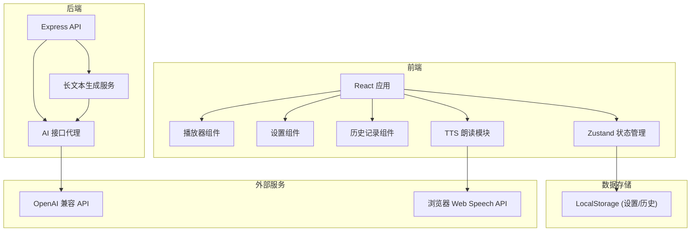

## 1. 架构设计



## 2. 技术描述

- **前端**：React@18 + TypeScript + tailwindcss@3 + zustand + react-router-dom
- **后端**：Express@4 + TypeScript
- **初始化工具**：vite-init
- **TTS**：浏览器内置 Web Speech API（无需额外服务）
- **AI接口**：OpenAI 兼容的流式接口（用户自行配置 API Key）
- **数据存储**：LocalStorage（配置、历史记录均本地存储，保护隐私）
- **跨平台方案**：PWA（渐进式Web应用），支持添加到桌面/主屏幕，离线可用

## 3. 路由定义

| 路由 | 用途 |
|------|------|
| / | 首页 - 主题设置与开始 |
| /player | 播放器 - 故事播放与控制 |
| /settings | 设置 - AI接口与语音配置 |
| /history | 历史 - 已生成的故事记录 |

## 4. API 定义

### 4.1 故事生成接口
```typescript
// 请求
interface GenerateStoryRequest {
  theme: string;          // 主题
  style: string;          // 风格: fantasy/knowledge/history/nature/meditation
  targetHours: number;    // 目标时长(小时)
  continueFrom?: string;  // 续写上一段的结尾内容
  chapterIndex?: number;  // 当前章节索引
}

// 响应 (SSE 流式)
interface StoryChunk {
  type: 'text' | 'chapter_title' | 'summary';
  content: string;
  chapterIndex: number;
}
```

### 4.2 接口列表
| 方法 | 路径 | 描述 |
|------|------|------|
| POST | /api/generate | 流式生成故事内容 (SSE) |
| GET | /api/models | 获取可用模型列表 |

## 5. 核心技术方案

### 5.1 长文本生成策略
- 采用"章节式"生成，每章约 2000-3000 字
- 每章生成后，将章节摘要+结尾传入下一章，保持故事连贯性
- 根据目标时长估算所需章节数（按每分钟约 200 字朗读速度计算）
- 支持断点续生成，刷新页面后可继续

### 5.2 TTS 朗读方案
- 使用浏览器 Web Speech API (SpeechSynthesis)
- 支持选择系统语音、调节语速和音调
- 分句朗读，避免长文本中断
- 支持暂停/继续，自动滚动高亮当前句

### 5.3 PWA 支持
- Service Worker 缓存静态资源
- Web App Manifest 配置
- 支持添加到主屏幕，全屏运行
- 支持后台播放（页面不可见时继续播放）

## 6. 数据模型

### 6.1 设置存储
```typescript
interface AppSettings {
  aiBaseUrl: string;
  apiKey: string;
  model: string;
  voiceName: string;
  speechRate: number;     // 0.5 - 2
  speechPitch: number;    // 0 - 2
  speechVolume: number;   // 0 - 1
  theme: 'dark' | 'light';
  fontSize: 'small' | 'medium' | 'large';
}
```

### 6.2 历史记录
```typescript
interface StoryHistory {
  id: string;
  theme: string;
  style: string;
  targetHours: number;
  createdAt: number;
  chapters: StoryChapter[];
  totalWords: number;
}

interface StoryChapter {
  index: number;
  title: string;
  content: string;
  wordCount: number;
}
```
